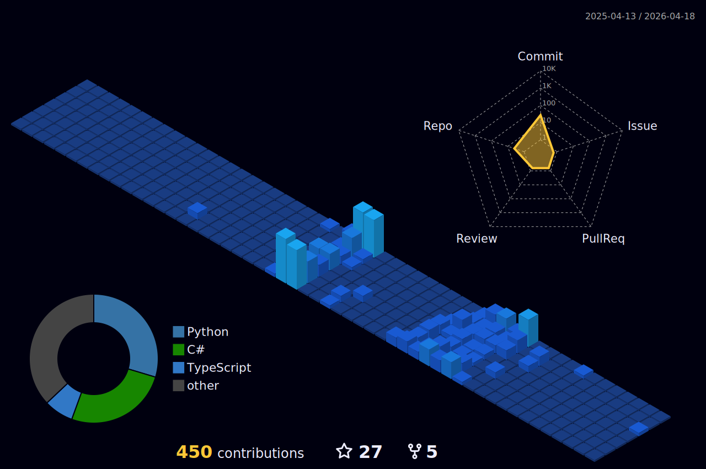

<h1 align="center">Hi 👋, I'm Burak Arslan</h1>
<h3 align="center">Full-time tech writer, part-time software learner, timeless MIS student.</h3>

  

🌱 I’m currently learning **.NET Core, RabbitMQ, Redis and Kubernetes**

👨‍💻 I love analysing and working on the algorithms of software projects

📝 I regularly write articles on [Technopat](https://www.technopat.net/author/burak-arslan/) and [HUAWEI Developers Medium](https://medium.com/@burakarslan0110)

🎯 My ultimate end goal **to be a Technical Architect**

📫 How to reach me **burakarslan0110@outlook.com**

### My Favourite Blog Posts
<!-- BLOG-POST-LIST:START -->
📰 [Yazılım Geliştiriciler için Vercel Alternatifi En İyi Deployment Çözümü: Coolify](https://medium.com/huawei-developers-tr/yazilim-gelistiriciler-icin-vercel-alternatifi-en-iyi-deployment-cozumu-coolify-8057a60dcfea)

📰 [GitHub Actions Nedir ve Yazılım Süreçlerini Nasıl Otomatikleştirir?](https://medium.com/huawei-developers-tr/yazilim-gelistiriciler-icin-vercel-alternatifi-en-iyi-deployment-cozumu-coolify-8057a60dcfea)

📰 [İlişkisel ve İlişkisel Olmayan Veritabanı Nedir, Farkları Nelerdir?](https://www.technopat.net/2024/08/30/iliskisel-ve-iliskisel-olmayan-veritabani-nedir-farklari-nelerdir/)

📰 [Dijital Dünyanın Yeni Altyapısı: Bulut Bilişim Nedir?](https://medium.com/@burakarslan0110/bulut-bilisim-nedir-8337e346ac51)

📰 [SAP Developer Edition Nasıl Kurulur?](https://www.technopat.net/2025/03/27/sap-developer-edition-nasil-kurulur/)

📰 [Çok Çekirdekli İşlemcilerin Tarihçesi](https://www.technopat.net/2022/02/28/cok-cekirdekli-islemcilerin-tarihcesi/)

<!-- BLOG-POST-LIST:END -->

<h3 align="left">Connect with me:</h3>

<h3 align="left">Languages and Tools:</h3>

       

&nbsp;

