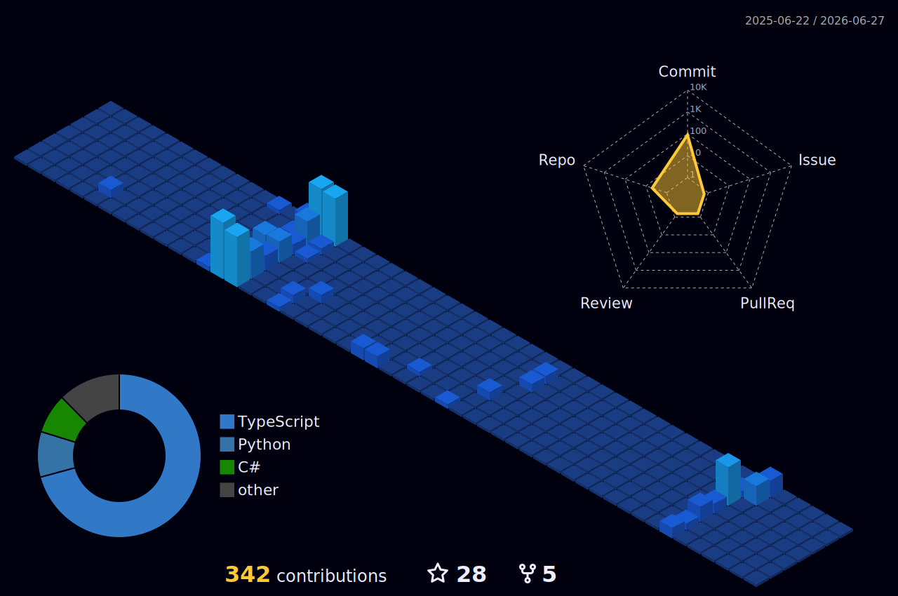

<h1 align="center">Hi 👋, I'm Burak Arslan</h1>
<h3 align="center">Backend Developer | Cloud, DevOps & AI Enthusiast</h3>

💼 Currently working as a **.NET Developer at Detaysoft**, building ERP integrations, backend services and AI/LLM infrastructure

🎓 MIS Student at **Sivas Cumhuriyet University** (4th year)

🏆 **2nd Place** at Türk Telekom Cloud Computing Camp with microservices e-commerce platform

🌱 Currently deepening my skills in **RAG, Agentic Workflows, MCP, and Cloud-Native Architectures**

🎯 My ultimate goal: **Technical Architect**

📫 Reach me at **burakarslan0110@outlook.com**

🔗 Connect on [LinkedIn](https://linkedin.com/in/burakarslann0110) · 🌐 [burakarslan.me](https://burakarslan.me)

---

### 🚀 Featured Projects

| Project | Description | Tech Stack |
|---------|-------------|------------|
| [**CodeWiKiTap**](https://github.com/burakarslan0110/CodeWiKiTap) | MCP server providing Google CodeWiki context to coding agents (Claude Code, Cursor, Codex CLI) | TypeScript, MCP, BM25, Vector Embedding, RRF, Cross-Encoder |
| [**Atlas Demo**](https://github.com/burakarslan0110/Atlas-Demo) | Award-winning microservices e-commerce platform | .NET 8, RabbitMQ, Redis, YARP, OpenSearch, Jaeger, K3S |
| [**SafeVerse**](https://github.com/burakarslan0110/SafeVerse-Project) | AI-powered earthquake safety app | ASP.NET Core 8, React Native, Docker, Azure |
| [**Taşhan Sofrası**](https://github.com/burakarslan0110/Tashan-Sofrasi-Web-App) | Real-time restaurant management with QR ordering | ASP.NET Core 8, SignalR, Docker Compose |
| [**Traversal**](https://github.com/burakarslan0110/Traversal_Project) | Travel platform with AI assistant & tour booking | ASP.NET Core 8, CQRS, Azure SQL, OpenAI |
| [**WinToolify**](https://github.com/burakarslan0110/WinToolify) | Windows system management tool (40+ commands) | PowerShell |

---

### 📜 Certifications

- 🤖 **Claude Code in Action** — Anthropic (2026)
- 🤖 **Model Context Protocol: Advanced Topics** — Anthropic (2026)
- ☁️ **HUAWEI Cloud Developer — Cloud Native** (2026)
- 🥈 **Türk Telekom Cloud Computing Camp** — 2nd Place (2025)
- ☁️ **HUAWEI Cloud Developer — Tech Essentials** (2025)
- ☁️ **Microsoft Azure Fundamentals (AZ-900)** (2025)
- 🌐 **Cisco CCNA: Switching, Routing, and Wireless Essentials** (2024)
- 🌐 **Cisco CCNA: Introduction to Networks** (2024)

---

### 🛠️ Tech Stack

**Backend & Frameworks**

   

 

**AI & LLM**

      

 

**AI-Assisted Development**

   

 

**Databases**

   

 

**DevOps & Cloud**

 

**Tools**

   

---

