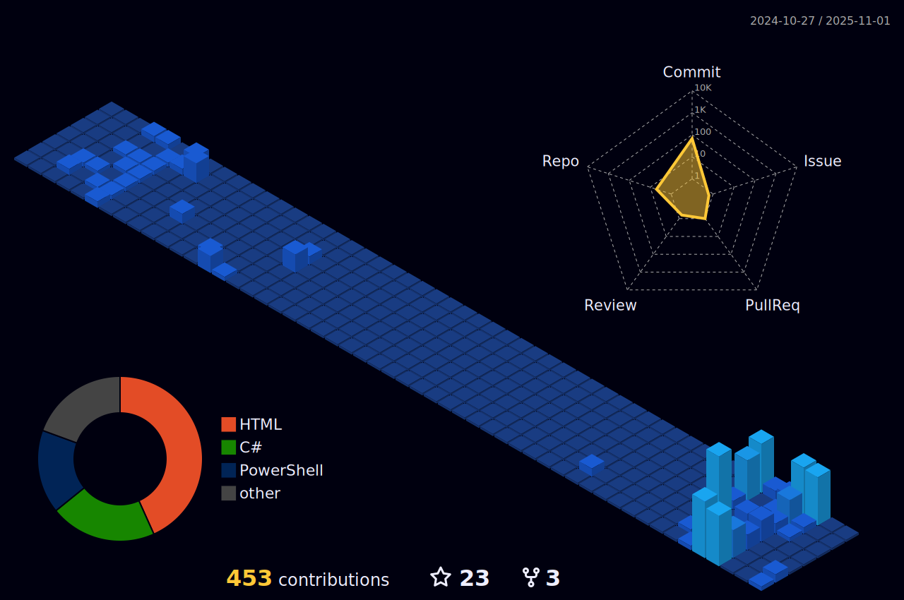

<h1 align="center">Hi 👋, I'm Burak Arslan</h1>
<h3 align="center">Backend Developer | DevOps & Cloud Enthusiast</h3>

  

💼 Currently working as a **.NET Developer at Detaysoft**, building ERP integrations and backend services

🎓 MIS Student at **Sivas Cumhuriyet University** (4th year)

🏆 **2nd Place** at Türk Telekom Cloud Computing Camp with microservices e-commerce platform

🌱 Currently deepening my skills in **Kubernetes, RabbitMQ, Redis, and Cloud Architecture**

🎯 My ultimate goal: **Technical Architect**

📫 Reach me at **burakarslan0110@outlook.com**

🔗 Connect on [LinkedIn](https://linkedin.com/in/burakarslann0110)

---

### 🚀 Featured Projects

| Project | Description | Tech Stack |
|---------|-------------|------------|
| [**Atlas**](https://github.com/burakarslan0110) | Award-winning microservices e-commerce platform | .NET 8, RabbitMQ, Redis, K3S, GitLab CI/CD |
| [**SafeVerse.tech**](https://github.com/burakarslan0110) | AI-powered earthquake safety app | ASP.NET Core 8, React Native, Docker, Azure |
| [**Taşhan Sofrası**](https://github.com/burakarslan0110) | Real-time restaurant management with QR ordering | ASP.NET Core 8, SignalR, Docker Compose |
| [**Traversal.live**](https://github.com/burakarslan0110) | Travel platform with AI assistant & tour booking | ASP.NET Core 8, CQRS, Azure SQL, OpenAI |
| [**WinToolify**](https://github.com/burakarslan0110) | Windows system management tool (40+ commands) | PowerShell |

---

### 🛠️ Tech Stack

**Backend & Frameworks**

**DevOps & Cloud**

**Databases**

**Tools**

---

### 📜 Certifications

- 🥈 **Türk Telekom Cloud Computing Camp** - 2nd Place (2025)
- ☁️ **Microsoft Azure Fundamentals (AZ-900)** (2025)
- ☁️ **HUAWEI Cloud Developer - HCDDA** (2025)
- 🌐 **Cisco CCNA: Switching, Routing, and Wireless** (2024)
- 🌐 **Cisco CCNA: Introduction to Networks** (2024)

---

